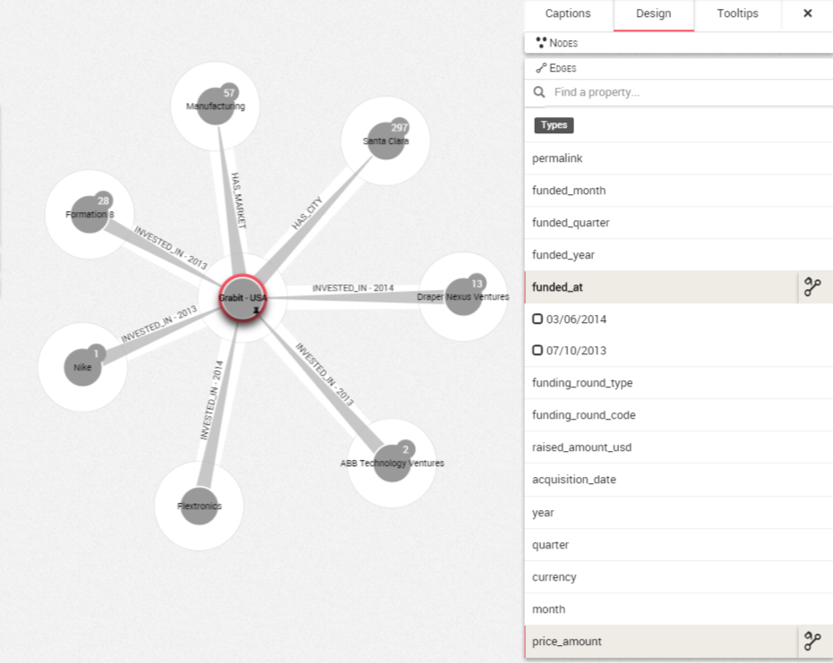
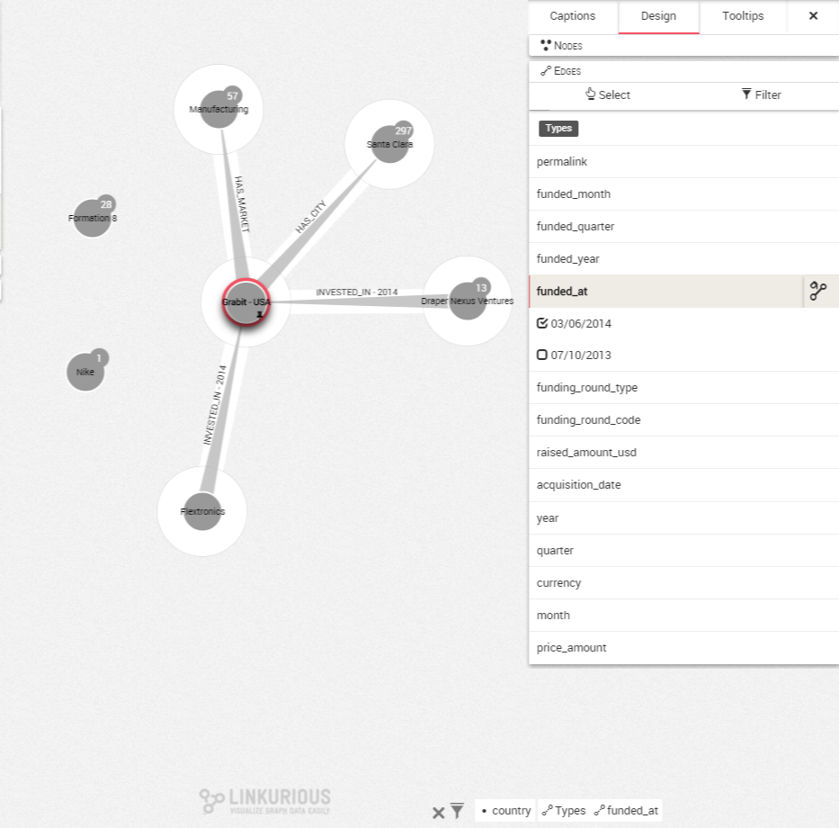

## Filtering the edges according to a property

We have seen it is possible to use filters to select or remove specific nodes in our visualization according to a property. It is possible to do the same thing with edges.


In the graph below we see the relationships of Grabit. Each relationship represents an investment in a start-up. But what kind of investment?

We can open up the design panel to investigate. Let's select ```Edges``` on the bottom right corner.

We can see the different properties attached to the relationships in our dataset.


We are going to focus on the ```funded_at```. Let's click on it.



We want to view only the funded_at with the ```03/06/2014``` code. Let's check the checkbox to keep only ```03/06/2014``` and click on ```Filter ```.




The relationships with the ```03/06/2014``` ```funded_at``` are displayed. The other ```funded_at``` values are removed from the visualization and a filter symbol is added on the bottom right corner.


