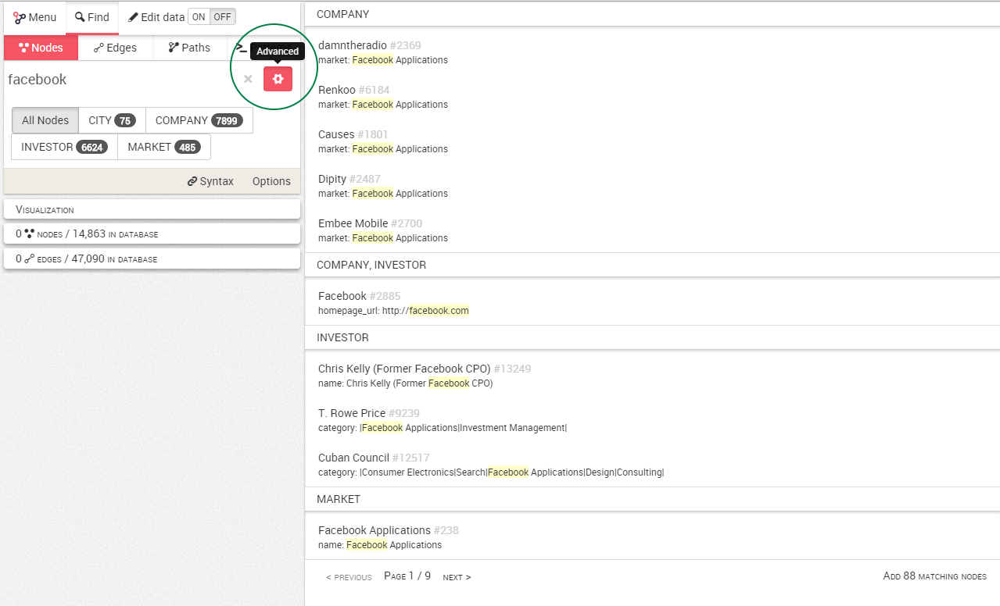

## Search nodes

We may have millions of nodes in our graph. What if we want to look at a specific node?

The first possibility is to use the Quick Search bar:


The second possibility is to use the search bar in the Linkurious Enterprise interface once we have created a New Visualization 


We simply type what we are looking for. We see the list of suggestions that match our search.


These results are sorted by labels.

For each result we can see
- The name of the node and its ID number (Instagram, #3886)
- The property that matches our search, highlighted in yellow (Here, the permalink of the company ```Instagram``` contains the text ```Instagram```)


We click on the result of our choice, it will be added to the canvas. Now we can visualize it.

> How it works : by default, Linkurious Enterprise indexes all the properties of your graph. If a node has a property that matches your search, it will be returned.


> For example, you could find the ```Instagram``` node by typing ```instagram```, or ```USA``` or ```2010-03```.


The bar search in New visualization provides an Advanced Search option not available through the Quick Search bar. We can thus reduce the results to the category of nodes we are interested in.



Voilà, we can now visualize our result.
