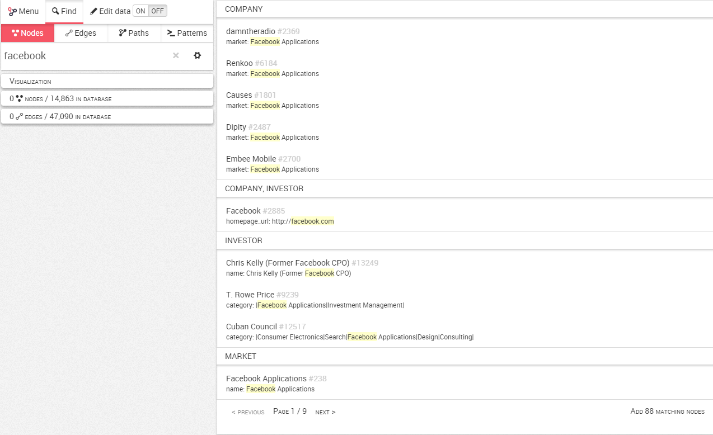
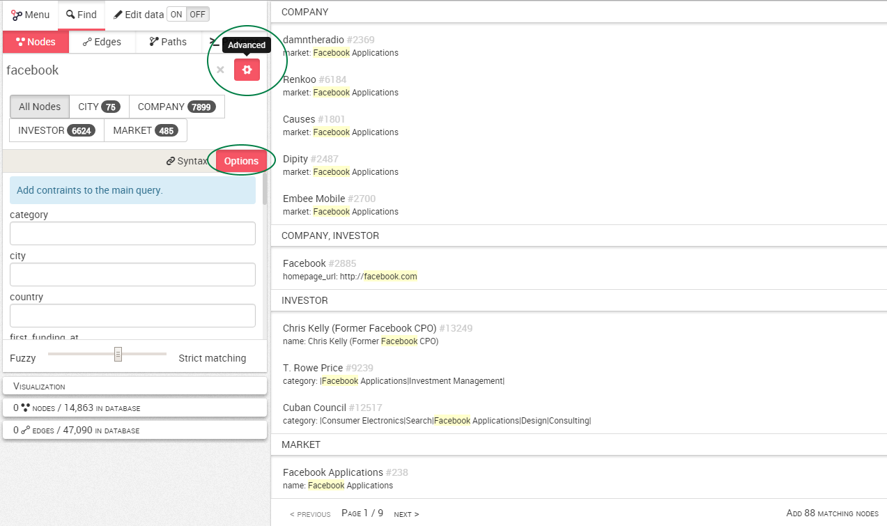
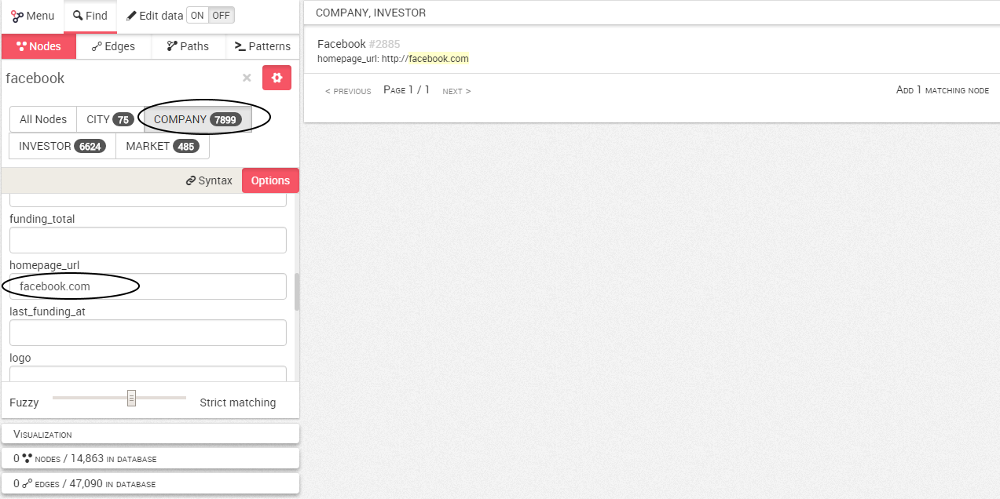

## Search on multiple properties

You are looking for a specific node or relationship and the search bar gives you too many results? The text you are searching is too common! 
You may want to narrow you search by searching on multiple properties.

Searching a startup that has the text ```facebook``` on any of his properties gives us 88 matches. Let's try to narrow it down.



We click on the  ```Advanced``` icon, a new menu appears:



We can see the name of the different categories (city, company, investor and market) in our database and their occurences.
We hit ```Options``` to see the name of the different properties in our graph.


In our graph, Facebook is categorized as a ```Company```. We are going to select ```Company``` to restrict our search to the nodes to the companies.

We can now see the different results.


In our graph, a ```Company``` can have properties like  ```category ```,  ```country```, ```first_funding_at ``` or ```founded_at``` and more. Not all the nodes categorised as a Company will have **all** the properties though.

In order to narrow down our results, we are going to search on multiple properties at once. To find Facebook, we are going to look for a company that uses facebook.com as its homepage url.



Now when we type ``facebook``, the results are filtered to show only the nodes that have the label ```Company``` and the value ``facebook.com`` for the property ```homepage_url```.


We can see that the results are now filtered. We can now select the result we are interested in.

The same approach can be applied to the search of edges.

> Linkurious Enterprise will look for **exact** matches for the values you enter in the search options menu.
