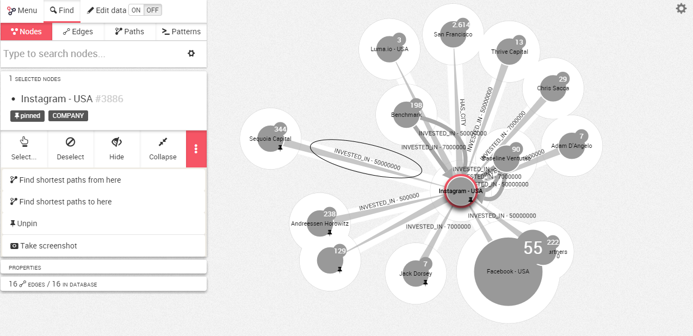
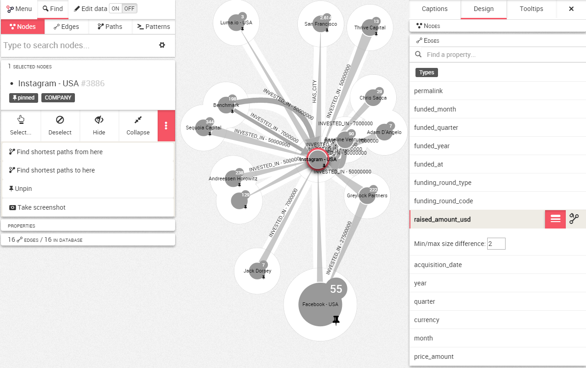

## Sizing the edges according to a property

Sizing the edges works exactly the same.

By default all the edges have the same size. It is possible though to choose to map the size of edges to certain properties. This way it will be possible to visualize that property.

This technique only applies to numbers ie to edges that have a property that is a number.

This works similarly to the coloring functionality of Linkurious Enterprise. Coloring and sizing can be combined to make powerful visualizations.



In the picture above we see the company Instagram with various companies that have invested in it.

If we zoom in on the relationship between Instagram and Sequoia Capital, we can see it has a ```raised_amount_usd``` property with the value ```55 000 000```.

We are going to size the different companies according to their ```raised amount``` property in order to to quickly glimpse who invested the most money in Instagram.

We click on the upper right corner to open up the design panel and choose the Edges tab.

We move the mouse to ```raised amount```. In addition to being able to color the edges according to that property, it is possible to size the edges. Linkurious Enterprise can do that for any property that has numerical values.

We are going to select the ```Size``` icon.





We are going to scroll to go to ```raised_amount_usd```, the property we are interested in. We can use it to color the relationships but, because that property has numercial values, we can also use it to **size** the relationships.


Simply click on ```Size```. A new menu appears. It makes it possible to set the ```Min/max size difference```, the difference in size between the relationship with the lowest value and the relationship with the highest value.


If we want to view the difference in ```funding_total_usd``` we are going to set the ```Min/max size difference``` to ```3```.


Now we can see that SoftBank Capital appears to have contributed the most to the funding of Criteo because the relationship between these two companies is the largest.
