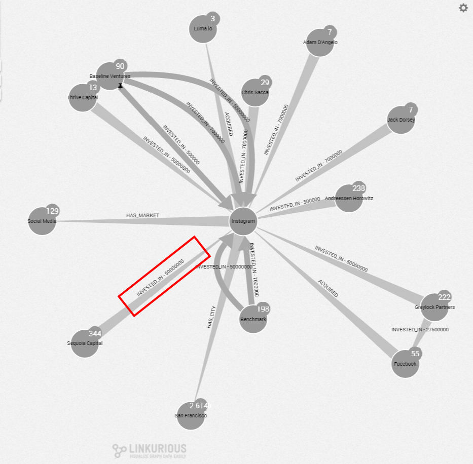

## Sizing the edges according to a property

Sizing the edges works exactly the same.

By default all the edges have the same size. It is possible though to choose to map the size of edges to certain properties. This way it will be possible to visualize that property.

This technique only applies to quantitative properties.

This works similarly to the coloring functionality of Linkurious Enterprise. Coloring and sizing can be combined to make powerful visualizations.



In the picture above we see the company Instagram with various companies that have invested in it.

If we zoom in on the relationship between Instagram and Sequoia Capital, we can see it has a ```raised_amount_usd``` property with the value ```55 000 000```.

We are going to size the different companies according to their ```raised amount``` property in order to quickly glimpse who invested the most money in Instagram.

We click on the upper right corner to open up the design panel and choose the Edges tab.

We move the mouse to ```raised amount```. In addition to being able to color the edges according to that property, it is possible to size the edges. Linkurious Enterprise can do that for any property that has numerical values.

We click on the ```Size``` icon.

A new menu appears. It makes it possible to set the ```Min/max size difference```, the difference in size between the node with the lowest value and the node with the highest value.

If we want to view the difference in ```raised amount``` we are going to set the ```Min/max size difference``` to ```2```.


Now we can see that few outliers appear thicker than the other edges.


