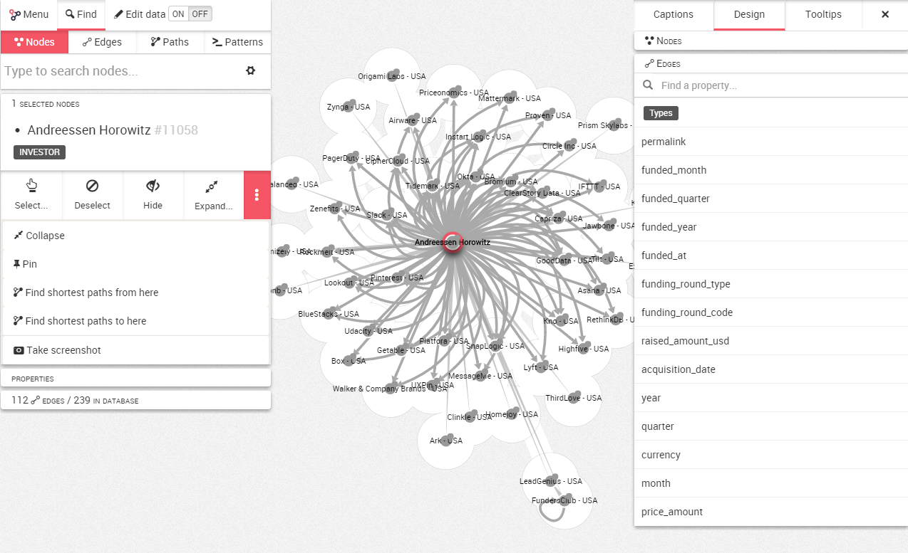
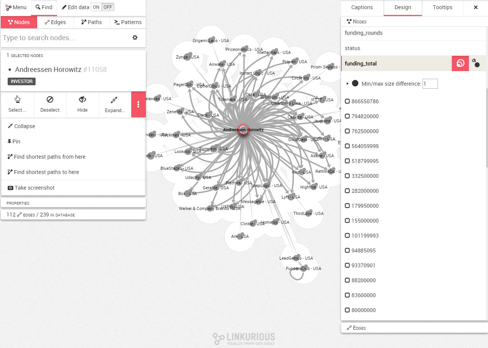
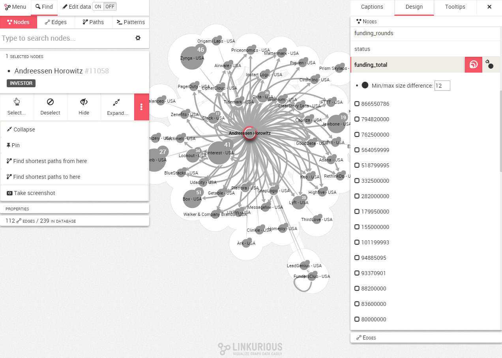

## Sizing the nodes according to a property

By default all the nodes have the same size. It is possible though to choose to map the size of nodes to certain properties. This way it will be possible to visualize that property.

This technique only applies to quantitative properties.

This works similarly to the coloring functionality of Linkurious Enterprise. Coloring and sizing can be combined to make powerful visualizations.

For example [Andreessen Horowitz](http://a16z.com/) is a leading VC firm with 127 relationships to different companies it has funded. Which companies have received the most funding? Hard to know by simply looking at this graph.



We are going to size the different companies according to their ```funding_total``` property in order to visualize which are the most successful.

We click on the upper right corner to open up the design panel.

We move the mouse to ```funding_total```. In addition to being able to color the nodes according to that property, it is possible to size the nodes. Linkurious Enterprise can do that for any property that has numerical values.

We are going to select the ```Size``` icon.



A new menu appears. It makes it possible to set the ```Min/max size difference```, the difference in size between the node with the lowest value and the node with the highest value.

If we want to view the difference in ```funding_total``` we set the ```Min/max size difference``` to ```12```.



Now we can see that few outliers appear as nodes larger than the other nodes.

The larger nodes represent companies like Airbnb, Box, Pinterest or Zynga. We can quickly identify them as the most successful investments of Andreessen Horowitz.
